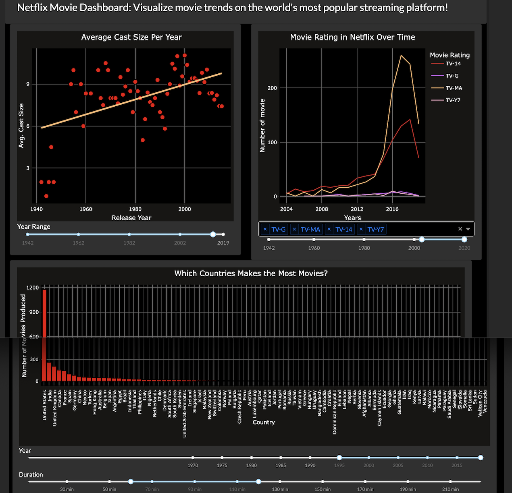
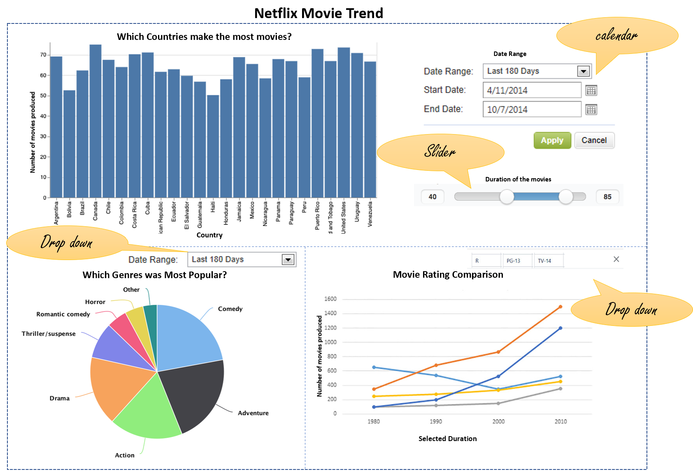

# :movie_camera: Netflix Movie Dashboard :movie_camera:

## About

Filming movies is an expensive and time-consuming process, so it's important that studios create movies that will appeal to large segments of the population. Netflix, one of the most popular streaming services available, is an ideal candidate for film studios to gather insights about global movie trends. Our Netflix Movie dashboard will help users make decisions about which types of films will most likely appeal to streaming platforms and their audiences. :tada:

This dashboard is based on 10 years of Netflix data (2008 - 2019). The app allows users to explore the trends of film genres on Netflix, film length, film rating, and filming location by country. The motivation for our dashboard is to visualize the types of films will most likely appeal to streaming platforms and their audiences. For further details, check out [our full app proposal](https://github.com/UBC-MDS/movie_dashboard/blob/main/Proposal.md)

## Contributors

- Masha Sasarafrazi
- Jasmine Ortega
- Sufang Tan

## Description of Dashboard

The app contains a landing page with three visualizations. A global filter of the year is located on the right-hand side of the menu controls these plots. Each plot will have an interactive filter to visualize trends over time. A dropdown menu will allow multi-selection of movie rating and a date range selector to narrow down genre results, based on movie release date.

### 1. Movie Count over Country (Bar chart) :earth_americas

A bar chart that depicts the number of movies belonging to a particular country in the selected period. Number of movies can also be filtered on the movie length ("Duration"), which will visualize which countries tend to produce longer movies. This visualization can help users gather insights into which countries are the most popular for filming locations.

### 2. Cast Count over Year (Scatter plot) :family

A scatter plot that shows the average cast size of movies released on Netlix, filtered over the movie release year. This visualization would help users answer the question, "How large/small are the cast sizes of movies released on Netflic?", and allow studios to make informed decisions on the cast sizes of films that Netflix hosts.

### 3. Release Year versus Movie Rating (Line chart) :calendar

Movie rating is an important factor when considering audience -- rating a film R vs. PG-13 massively shifts the audience a movie is geared towards. In this plot, users will see a line plot depicting how the number of movies produced for a particular rating has changed over time. This visualization will answer the question, "Do people have more tendency for specific movie rating in recent years?". This could help the production team make a more informed choice on what content should be or should not be in their movies, as well as predict when the demand is high for certain film ratings.

## App Sketch

## Contributing

Interesting in contributing to this dashboard? Make sure to check out our [Code of Conduct] (<https://github.com/UBC-MDS/movie_dashboard/blob/main/CODE_OF_CONDUCT.md>)!

This dashboard was created using `Altair` and `Dash` and is powered by `Heroku`. Check out these onboarding documents to learn more about these tools:

- [DSCI 531: Visualization I](https://pages.github.ubc.ca/mds-2021-22/DSCI_531_viz-1_students/intro.html): A great starting point for those new to Altair
- [Building a basic Dash app](https://pages.github.ubc.ca/mds-2021-22/DSCI_532_viz-2_students/materials/lectures/2-building-a-basic-dash-app.html): Excellent step by step guide from UBC's Master of Data Science DSCI 532 class

## License

Netflix Movie Tracker operates a under MIT License.

Copyright (c) 2022, Jasmine Ortega, Mahsa Sarafrazi, Sufang Tan
